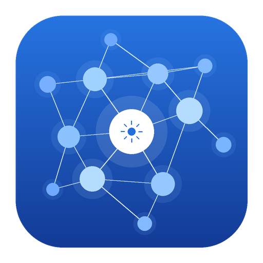
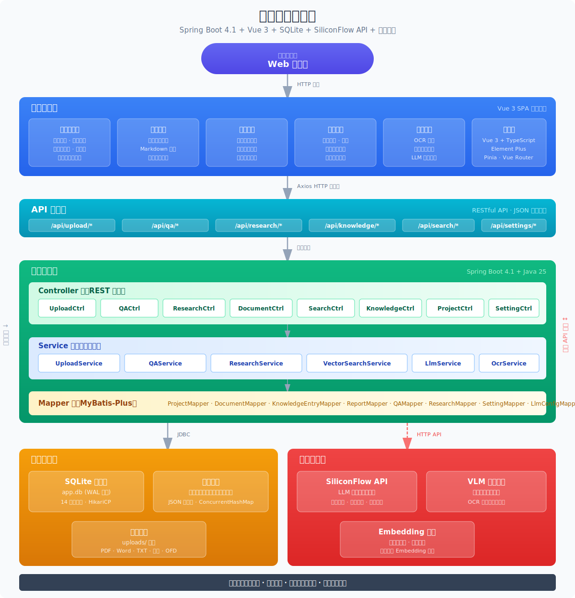

# Personal Knowledge Base

<p align="center">
  
</p>
<p align="center">
  <strong>A professional intelligence analysis platform for unmanned systems research.</strong>

  Upload documents, build knowledge graphs, and query intelligently — all powered by LLMs.
</p>
<p align="center">
  <a href="#what-is-this">What is this?</a> •
  <a href="#features">Features</a> •
  <a href="#system-architecture">Architecture</a> •
  <a href="#tech-stack">Tech Stack</a> •
  <a href="#installation">Installation</a> •
  <a href="#building-from-source">Build from Source</a> •
  <a href="#credits">Credits</a> •
  <a href="#license">License</a>
</p>
<p align="center">
  English | <a href="README_CN.md">中文</a>
</p>

---

<p align="center">
  
</p>

## Features

- **Graph-RAG Q&A** — knowledge-graph-powered retrieval-augmented generation with semantic search, cross-document verification, source traceability, and confidence scoring
- **Deep Research** — multi-step reasoning, cross-source synthesis, progress visualization for systematic investigation of complex topics
- **Multi-Format Document Ingestion** — upload PDFs, Word, Excel, images (OCR), and plain text with automatic structure recognition and key information extraction
- **4-Signal Knowledge Graph** — relevance model combining direct links, source overlap, Adamic-Adar, and keyword overlap
- **Louvain Community Detection** — automatic knowledge cluster discovery with cohesion scoring
- **Contradiction Detection** — identifies conflicting conclusions and data inconsistencies across sources, with severity-based classification
- **Dual-Workspace Architecture** — front-end analysis workspace and back-end management workspace, sharing data with isolated permissions
- **Project Isolation** — multi-project support with independent knowledge bases and seamless project switching
- **Local-First** — all data stored in local SQLite, no cloud dependency, works offline
- **Vector Semantic Search** — FAISS-based embedding retrieval, supports any OpenAI-compatible endpoint
- **Native Desktop App** — Tauri 2 desktop application with system tray, global shortcuts, and auto-update

## What is this?

Personal Knowledge Base is a desktop application purpose-built for **analysts and researchers working on unmanned systems (UAVs, UGVs, USVs, UUVs)**. It turns your documents into an organized, interlinked knowledge base — automatically. Unlike traditional RAG (which retrieves and answers from scratch on every query), this system **incrementally builds and maintains structured knowledge entries**. Knowledge is compiled once and kept current, not re-derived on every query.

This project is based on [Karpathy's LLM Wiki pattern](https://gist.github.com/karpathy/442a6bf555914893e9891c11519de94f) and inspired by [LLM Wiki](https://github.com/nashsu/llm_wiki). We implemented the core ideas as a full-stack desktop application with significant enhancements in specialized document management and analysis.

### How Does This Compare to LLM Wiki?

| Aspect | LLM Wiki | Personal Knowledge Base |
|--------|----------|------------------------|
| Focus | General-purpose personal knowledge base | Specialized intelligence platform for unmanned systems research |
| Architecture | Single app (Tauri + React) | Dual app (Spring Boot + Vue 3 + Tauri) |
| Database | File-based wiki | SQLite + MyBatis-Plus ORM |
| Frontend | React + shadcn/ui | Vue 3 + Element Plus |
| Document Types | Markdown, web pages | PDF, Word, Excel, images (OCR), plain text |
| Knowledge Format | Wiki pages (YAML frontmatter) | Structured entries + taxonomy |
| Project Model | Single wiki | Multi-project isolation |
| Graph Visualization | sigma.js | ECharts |
| Standout Features | Web clipper, Obsidian compatibility | Contradiction detection, research direction suggestions, report generation |

## System Architecture

```
┌─────────────────────────────────────────────────────────┐
│             Frontend (Vue 3 + Element Plus)              │
│  ┌──────────────┐     ┌──────────────────────────────┐  │
│  │   Portal     │     │         Admin                │  │
│  │  (Analysis)  │     │      (Management)            │  │
│  │  Entries,    │     │  Dashboard, Sources, Reports │  │
│  │  Q&A,        │     │  Charts, Graph, Config...    │  │
│  │  Research    │     │                              │  │
│  └──────┬───────┘     └──────────┬───────────────────┘  │
└─────────┼────────────────────────┼──────────────────────┘
          │     REST API (HTTP)     │
┌─────────┼────────────────────────┼──────────────────────┐
│         ▼                        ▼                      │
│              Backend (Spring Boot 4.1)                   │
│  ┌─────────────┐  ┌──────────┐  ┌───────────┐  ┌────┐ │
│  │ LLM Service │  │ Vector   │  │ Document   │  │Graph│ │
│  │ (Chat /     │  │ Search   │  │ Upload     │  │Svc  │ │
│  │ Embedding)  │  │ (FAISS)  │  │ Service    │  │     │ │
│  └──────┬──────┘  └────┬─────┘  └─────┬─────┘  └──┬─┘ │
│         │              │              │             │   │
│  ┌──────▼──────────────▼──────────────▼─────────────▼┐  │
│  │            SQLite Database (WAL Mode)              │  │
│  └──────────────────────────────────────────────────┘  │
└─────────────────────────────────────────────────────────┘
          │
          ▼
   External LLM APIs
   (DeepSeek, SiliconFlow, OpenAI, etc.)
```

## Feature Highlights

### 1. Dual-Workspace Architecture

The application separates the front-end **Analysis Workspace** from the back-end **Management Workspace**:

**Portal — Analysis Workspace:**
- **Entry Encyclopedia** — knowledge entry cards with search, filtering, and detail modals (Markdown rendered), distinguished by type (images, tables, documents, etc.)
- **Intelligent Q&A** — Graph-RAG conversational interface with session history on the left, conversation panel on the right, cited source panels, and multi-turn dialogue
- **Deep Research** — task list and new research creation on the left, results display on the right, multi-step reasoning progress bar, cross-source synthesis

**Admin — Management Workspace:**
- **Dashboard** — statistics cards (source count, project count), latest sources table, active projects
- **Source Library** — URL ingestion, file upload, re-extraction
- **Report Library** — search, pagination, upload, status filtering
- **Chart Library** — image/table categorized upload, OCR recognition, multi-table merging
- **Project Library** — project list, create/edit, project details
- **Knowledge Graph** — ECharts force-directed layout, color by type/community, graph building
- **Source Management** — source document list, folder import, source refresh
- **System Config** — LLM / OCR / vector embedding / web search / graph building / general settings

### 2. Graph-RAG Intelligent Q&A

Unlike traditional RAG that retrieves and answers from scratch on every query, this system uses **knowledge-graph-powered retrieval-augmented generation**:

```
Phase 1: Semantic Retrieval
  - FAISS vector index for fast semantic document lookup
  - CJK tokenization for Chinese + stop word filtering for English
  - Title match bonus (+10 score)

Phase 2: Graph Expansion
  - 4-signal relevance model discovers related pages
  - 2-hop traversal with decay for deeper connections

Phase 3: Context Assembly
  - Numbered pages with full content
  - LLM cites sources by number: [1], [2], etc.
  - Confidence scoring and cross-document verification
```

### 3. 4-Signal Knowledge Graph

Built on ECharts force-directed layout with a complete relevance engine:

**4-Signal Relevance Model:**

| Signal | Weight | Description |
|--------|--------|-------------|
| Direct Link | ×3.0 | Pages that are directly linked |
| Source Overlap | ×4.0 | Pages sharing the same raw source |
| Adamic-Adar | ×1.5 | Pages sharing common neighbors |
| Keyword Overlap | ×1.0 | Pages with overlapping keywords (larger intersection = higher score) |

**Graph Visualization:**
- Nodes colored by page type or community
- Edge thickness and color vary by relevance weight
- Zoom controls (zoom in, zoom out, fit to screen)
- Louvain community detection + cohesion scoring
- Graph insights: isolated nodes, sparse connections

### 4. Deep Research

When the system identifies knowledge gaps:

- **Multi-Step Reasoning** — LLM analyzes step by step with a reasoning progress bar
- **Cross-Source Synthesis** — synthesizes perspectives from multiple sources with cross-verification
- **Progress Visualization** — research progress streamed in real time
- **Report Generation** — automatically produces structured research reports
- **Auto-Ingest** — research results are automatically processed to extract entities and concepts into the knowledge base

### 5. Contradiction Detection & Research Direction Suggestions

Not in the original design. The system **automatically analyzes conclusions across multiple sources**:

- **Conclusion Conflict Detection** — identifies contradictory descriptions of the same topic across different sources
- **Data Inconsistency** — discovers discrepancies in numbers, dates, and other data points
- **Severity Classification** — categorized by severity level (high / medium / low)
- **Direction Suggestions** — generates research direction recommendations based on existing sources

### 6. Multi-Format Document Support

| Format | Processing |
|--------|-----------|
| PDF | Apache PDFBox parsing with text extraction and structure recognition |
| Word (DOCX) | Apache POI parsing, preserving headings, bold, lists, and tables |
| Excel (XLSX) | Apache POI parsing with multi-sheet support |
| Images | Tesseract OCR text recognition |
| Text / Markdown | Direct read, UTF-8 encoding |

### 7. Desktop Application Features

Built as a native desktop application on **Tauri 2**:

- **System Tray** — show/hide window, restart backend, open data directory, quit
- **Backend Status Monitor** — tri-color status indicator (green/yellow/red), click for JVM memory details
- **Splash Screen** — tech-style logo animation with loading status and 30-second timeout
- **Global Shortcuts** — `Cmd/Ctrl+Q` quit, `Cmd/Ctrl+W` hide window, `Cmd/Ctrl+,` open settings
- **First-Run Wizard** — configure LLM API key, choose data storage location, create a sample project
- **Auto-Update** — built-in Tauri updater, checks for updates from GitHub Releases
- **Error Handling** — global ErrorBoundary, user-friendly error messages, auto-retry (up to 3 attempts)
- **Single Instance Guard** — prevents multiple instances, focuses existing window on second launch

### 8. Project Data Isolation

- Full data isolation across projects via `X-Project-Id` request header
- Each project has its own independent knowledge base, sources, charts, and configuration
- One-click project switching in the portal top bar
- Full CRUD support for projects

### 9. Vector Semantic Search

- **FAISS Vector Index** — powered by SiliconFlow Embedding API (BGE-large-zh-v1.5)
- **Semantic Retrieval** — discovers related documents even without keyword overlap
- **Hybrid Retrieval** — three-way fusion of vector search, keyword search, and graph expansion
- **Fully Optional** — disabled by default, enable in settings, supports any OpenAI-compatible endpoint

## Tech Stack

| Layer | Technology |
|-------|-----------|
| Desktop | Tauri 2 (Rust backend + Spring Boot sidecar) |
| Frontend | Vue 3.5 + Element Plus 2.14 + TypeScript + Vite |
| Backend | Spring Boot 4.1 + MyBatis-Plus 3.5 + Java 25 |
| Database | SQLite (WAL mode) |
| AI / LLM | OpenAI-compatible API (DeepSeek, SiliconFlow, OpenAI, etc.) |
| Embeddings | SiliconFlow Embedding API (BGE-large-zh-v1.5) |
| Vector Search | FAISS |
| Graph Visualization | ECharts (force-directed layout) |
| State Management | Pinia |

## Installation

### Pre-built Installer

Download from [GitHub Releases](https://github.com/setsu2420/Personal-KnowledgeBase/releases):

- **macOS**: `.dmg` (Apple Silicon + Intel)

> More platforms (Windows `.msi`, Linux `.deb` / `.AppImage`) coming soon.

### Prerequisites

- **Java 21+** (required for the backend)
- An LLM API key (DeepSeek, OpenAI, or any OpenAI-compatible provider)
- A vector embedding API key (SiliconFlow or other provider, optional)

### Quick Start

1. Download and install the `.dmg` file
2. Launch the app → the first-run wizard will guide you through setup
3. Go to **Admin → System Config** → configure your LLM provider (API key + model)
4. Go to **Admin → Source Library** → upload your research documents
5. Start asking questions in **Portal → Intelligent Q&A**

## Building from Source

### Prerequisites

- **Java 21+** and Maven 3.8+
- **Node.js 18+** and npm 9+
- **Rust 1.70+** and Cargo
- An LLM API key

### 1. Clone the Repository

```bash
git clone https://github.com/setsu2420/Personal-KnowledgeBase.git
cd Personal-KnowledgeBase
```

### 2. Configure Environment Variables

```bash
cp .env.example .env
```

Edit `.env` with your API keys:

```bash
# LLM Configuration
LLM_API_KEY=sk-your-llm-api-key
LLM_API_BASE_URL=https://api.deepseek.com
LLM_MODEL=deepseek-chat
LLM_PROVIDER=deepseek

# Vector Embedding Configuration (optional)
EMBEDDING_API_KEY=sk-your-embedding-api-key
EMBEDDING_API_BASE_URL=https://api.siliconflow.cn
EMBEDDING_MODEL=BAAI/bge-large-zh-v1.5
```

### 3. Build the Desktop App

```bash
# Build backend JAR
cd backend-springboot && mvn clean package -DskipTests && cd ..

# Prepare sidecar
mkdir -p src-tauri/binaries
cp backend-springboot/target/backend.jar src-tauri/binaries/

# Install frontend dependencies
cd frontend-vue && npm install && cd ..

# Build Tauri desktop app
./frontend-vue/node_modules/.bin/tauri build
```

Build artifacts are in `src-tauri/target/release/bundle/`:
- macOS: `dmg/*.dmg`
- Windows: `nsis/*.exe`
- Linux: `deb/*.deb`, `appimage/*.AppImage`

### 4. Development Mode

```bash
# Terminal 1: Start backend
cd backend-springboot && ./mvnw spring-boot:run

# Terminal 2: Start frontend + Tauri
cd frontend-vue && npm run tauri:dev
```

### 5. Web-Only Mode (without Tauri)

```bash
# Terminal 1: Start backend
cd backend-springboot && ./mvnw spring-boot:run

# Terminal 2: Start frontend
cd frontend-vue && npm run dev
```

Visit `http://localhost:5173`:
- Portal: `http://localhost:5173/portal`
- Admin: `http://localhost:5173/admin`

## Web Mode (Browser-based)

In addition to the Tauri desktop app, the platform supports a **Web Mode** that runs entirely in the browser — no desktop installation required. This is ideal for server deployments, remote access, or users who prefer a browser-based workflow.

### Quick Start

The easiest way to launch Web Mode is with the provided startup script:

```bash
./start-web.sh
```

This script automatically:
1. Checks and starts MySQL if needed
2. Creates the database if it doesn't exist
3. Starts the Spring Boot backend (port 8080)
4. Waits for the backend to be ready
5. Starts the Vue frontend (port 5173)

### Manual Start

You can also start the frontend and backend separately:

```bash
# Terminal 1: Start backend
cd backend-springboot && ./mvnw spring-boot:run

# Terminal 2: Start frontend
cd frontend-vue && npm run dev
```

### Access URLs

Once running, open your browser to:

| Workspace | URL |
|-----------|-----|
| Frontend (Portal) | http://localhost:5173/portal |
| Backend (Admin) | http://localhost:5173/admin |
| Backend API | http://localhost:8080/api |
| Health Check | http://localhost:8080/api/health |

### Differences from Desktop Mode

| Feature | Desktop Mode (Tauri) | Web Mode (Browser) |
|---------|---------------------|-------------------|
| Installation | Download and install `.dmg` / `.exe` | No installation — just start the services |
| Access | Native window with system tray | Any modern browser |
| System Tray | ✅ Show/hide, restart, quit | ❌ Not available |
| Global Shortcuts | ✅ `Cmd/Ctrl+Q`, `Cmd/Ctrl+W`, etc. | ❌ Browser shortcuts only |
| Auto-Update | ✅ Built-in Tauri updater | ❌ Manual update via `git pull` |
| Splash Screen | ✅ Native loading animation | ❌ Standard web loading |
| Backend Lifecycle | Auto-managed by Tauri sidecar | Manual start/stop required |
| Multi-Device Access | ❌ Single machine only | ✅ Any device on the network |
| Core Features | Full feature set | Full feature set (identical) |

All analysis features — Graph-RAG Q&A, Deep Research, Knowledge Graph, Contradiction Detection, etc. — work identically in both modes.

### Stopping Services

If started via `./start-web.sh`, press `Ctrl+C` to stop both services. If started manually:

```bash
kill <BACKEND_PID>   # stop backend
kill <FRONTEND_PID>  # stop frontend
```

## Configuration

### LLM Configuration

Two configuration methods are supported:

1. **Environment variables** (`.env` file) — loaded at startup as default config
2. **In-app settings** — go to Admin → System Config → LLM

Supported providers: DeepSeek, OpenAI, Anthropic, Azure OpenAI, SiliconFlow, Qwen, Moonshot (Kimi), Google Gemini, Ollama, and more.

### Data Storage

- Database: `{app_data_dir}/intelligence_platform.db` (SQLite WAL mode)
- Uploaded files: `{app_data_dir}/uploads/`
- Logs: `{app_data_dir}/logs/`

## Project Structure

```
Personal-KnowledgeBase/
├── frontend-vue/                 # Vue 3 frontend
│   ├── src/
│   │   ├── views/portal/         # Portal pages (Entries, Q&A, Deep Research)
│   │   ├── views/admin/          # Admin pages (Dashboard, Sources, Reports, Config, etc.)
│   │   ├── components/           # Shared components (splash screen, status monitor, error handling)
│   │   ├── composables/          # Tauri API wrappers
│   │   ├── api/                  # Axios API client
│   │   ├── router/               # Vue Router routes
│   │   └── store/                # Pinia state management
│   └── package.json
├── backend-springboot/           # Spring Boot backend
│   └── src/main/java/.../
│       ├── controller/           # 23 REST controllers
│       ├── service/              # Business logic layer
│       ├── mapper/               # MyBatis-Plus data access
│       └── model/                # Data models
├── src-tauri/                    # Tauri desktop shell
│   ├── src/
│   │   ├── lib.rs                # App config, shortcuts, plugin registration
│   │   ├── sidecar.rs            # Spring Boot JAR start/stop
│   │   └── tray.rs               # System tray
│   ├── icons/                    # App icons
│   └── tauri.conf.json
├── scripts/                      # Build scripts
│   ├── build-macos.sh
│   ├── build-windows.ps1
│   ├── build-linux.sh
│   └── build-all.sh
├── docs/                         # Project docs + architecture diagrams
├── .env.example                  # Environment variable template
└── README_CN.md
```

## Documentation

- [System Architecture](docs/architecture.md) — architecture and tech stack details
- [API Reference](docs/api-reference.md) — full REST API documentation (100+ endpoints)
- [Frontend Pages](docs/frontend-pages.md) — page descriptions and navigation structure
- [Project Introduction](docs/project-introduction.md) — detailed feature specification

## Credits

The foundational methodology comes from **Andrej Karpathy**'s [LLM Wiki pattern](https://gist.github.com/karpathy/442a6bf555914893e9891c11519de94f), which describes the design pattern of using LLMs to incrementally build and maintain a personal wiki.

Special thanks to Yong Su's [LLM Wiki](https://github.com/nashsu/llm_wiki) project — its concrete desktop application implementation inspired many of our feature designs, including the knowledge graph relevance model, community detection, and deep research workflow.

Built with [Vue 3](https://vuejs.org/), [Element Plus](https://element-plus.org/), [Spring Boot](https://spring.io/projects/spring-boot), [Tauri 2](https://tauri.app/), and [ECharts](https://echarts.apache.org/).

## License

This project is open-sourced under the MIT License — see [LICENSE](LICENSE) for details.
