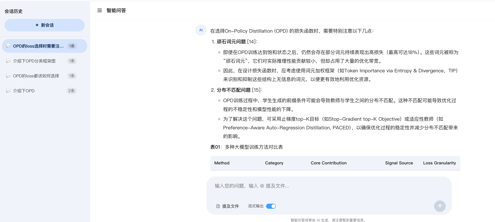
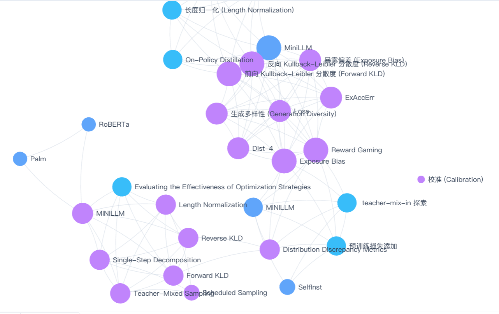
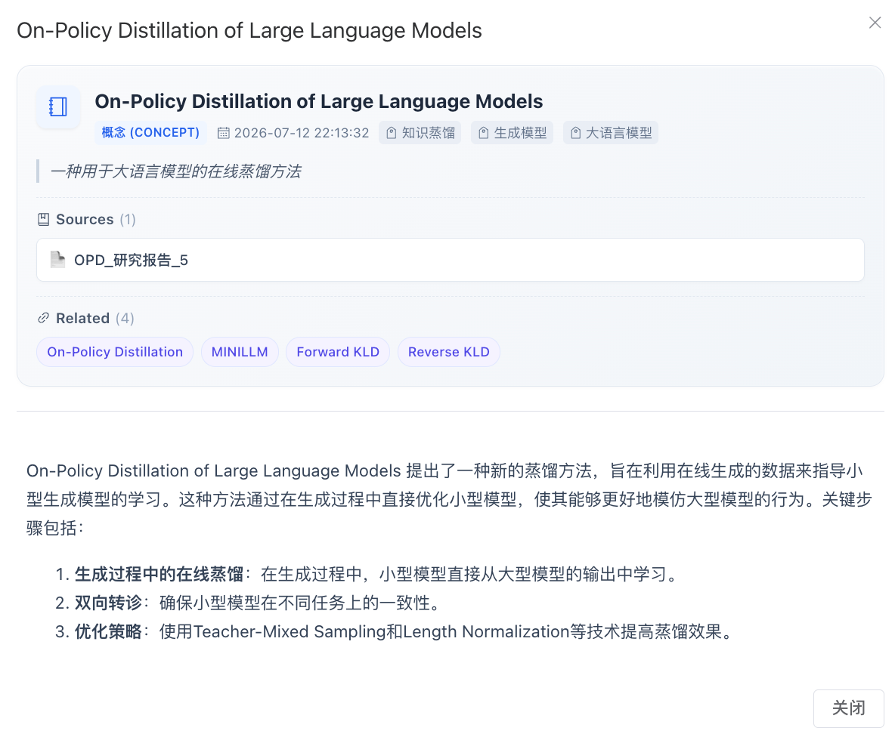
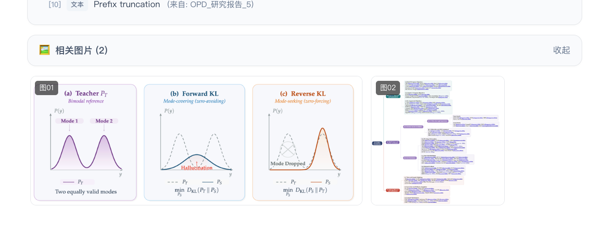

<p align="center">
  <br>
  <h1 align="center">IntelliSense Platform</h1>
  <p align="center">
    <strong>面向无人系统研究的智能情报分析平台</strong><br>
    上传文档 → 构建知识图谱 → 智能问答 —— 全流程由大语言模型驱动。
  </p>
</p>

<p align="center">
  <a href="https://github.com/setsu2420/Personal-KnowledgeBase/stargazers"></a>
  <a href="https://github.com/setsu2420/Personal-KnowledgeBase/blob/main/LICENSE"></a>
  <a href="https://github.com/setsu2420/Personal-KnowledgeBase/releases"></a>
  <br>
  
  
  
  
  
</p>

<p align="center">
  <a href="README.md">English</a> | 中文
</p>

---

## 📖 目录

- [✨ 界面展示](#-界面展示)
- [🤔 IntelliSense 是什么？](#-intellisense-是什么)
- [🚀 核心特性](#-核心特性)
- [🏗️ 系统架构](#️-系统架构)
- [🛠️ 技术栈](#️-技术栈)
- [⚡ 快速开始](#-快速开始)
- [🔍 功能详解](#-功能详解)
  - [1. Graph-RAG 智能问答](#1-graph-rag-智能问答)
  - [2. 四信号知识图谱](#2-四信号知识图谱)
  - [3. 深度研究](#3-深度研究)
  - [4. 矛盾检测与方向建议](#4-矛盾检测与方向建议)
  - [5. 多格式文档支持](#5-多格式文档支持)
  - [6. 桌面应用特性（Tauri 2）](#6-桌面应用特性tauri-2)
- [⚖️ 与 LLM Wiki 的对比](#️-与-llm-wiki-的对比)
- [📁 项目结构](#-项目结构)
- [⚙️ 配置说明](#️-配置说明)
- [📚 文档](#-文档)
- [🙏 致谢](#-致谢)
- [📄 许可证](#-许可证)

---

## ✨ 界面展示

<table align="center">
  <tr>
    <td align="center"><strong>🤖 智能问答</strong></td>
    <td align="center"><strong>🔗 知识图谱</strong></td>
  </tr>
  <tr>
    <td></td>
    <td></td>
  </tr>
  <tr>
    <td align="center"><strong>📚 词条百科</strong></td>
    <td align="center"><strong>🖼️ 图片管理</strong></td>
  </tr>
  <tr>
    <td></td>
    <td></td>
  </tr>
</table>

---

## 🤔 IntelliSense 是什么？

**IntelliSense Platform** 是一款专为**无人系统（无人机 / 无人车 / 无人船 / 无人潜航器）研究分析人员**打造的专业化桌面应用。它能将你的各类文档 —— PDF、Word、Excel、图片 —— 自动转化为有条理、相互关联且可查询的知识库。

> 不同于传统 RAG 每次查询都从零检索和推导答案，IntelliSense **增量式地构建和维护结构化的知识词条**。知识只需编译一次并持续更新，而非每次查询都重新推导。

### 🧬 设计理念

- **知识优先，而非检索优先** —— 结构化词条 > 临时检索
- **本地离线** —— 你的数据永不离开你的设备
- **多项目隔离** —— 一个工具，多个项目，零数据泄露
- **LLM 增强，人工策展** —— AI 承担繁重工作，你保持控制权

本项目根植于 [Andrej Karpathy 的 LLM Wiki 模式](https://gist.github.com/karpathy/442a6bf555914893e9891c11519de94f)，并从 [LLM Wiki](https://github.com/nashsu/llm_wiki) 项目中汲取灵感，在无人系统领域的专业化文档分析方面做了大量扩展与增强。

---

## 🚀 核心特性

| # | 特性 | 说明 |
|---|------|------|
| 🔍 | **Graph-RAG 智能问答** | 基于知识图谱的检索增强生成，融合语义搜索、多文档交叉验证、来源溯源与置信度评分 |
| 🧠 | **深度研究** | 多步 LLM 推理，跨资料综合，实时过程可视化 |
| 📄 | **多格式解析** | PDF、Word、Excel、图片（OCR）及纯文本的自动结构识别与关键信息抽取 |
| 🔗 | **四信号知识图谱** | 直接关联、来源重叠、Adamic-Adar、关键词重叠四维相关度模型 |
| 🧩 | **Louvain 社区检测** | 自动发现知识聚类，支持内聚度评分 |
| ⚠️ | **矛盾检测** | 自动识别多份资料之间的结论冲突与数据不一致，按严重程度分级管理 |
| 🏠 | **双空间架构** | 前台分析工作台 + 后台管理工作空间，数据共用、权限隔离 |
| 📦 | **项目隔离** | 多项目独立知识库，一键切换 |
| 🖥️ | **本地优先** | 所有数据本地存储，无云依赖，断网可用 |
| 🧲 | **向量语义搜索** | 基于 FAISS 的嵌入检索，兼容任意 OpenAI 格式接口 |
| 🪟 | **原生桌面应用** | Tauri 2 桌面端，支持系统托盘、全局快捷键、自动更新 |

---

## 🏗️ 系统架构

```
┌──────────────────────────────────────────────────────────────┐
│                   前端（Vue 3 + Element Plus）                 │
│  ┌────────────────────────┐   ┌──────────────────────────┐  │
│  │     分析工作台          │   │      管理工作台           │  │
│  │                        │   │                          │  │
│  │  • 词条百科            │   │  • 仪表盘与统计           │  │
│  │  • 智能问答            │   │  • 来源管理               │  │
│  │  • 深度研究            │   │  • 图谱可视化             │  │
│  │  • 知识图谱            │   │  • 系统配置               │  │
│  └───────────┬────────────┘   └─────────────┬────────────┘  │
└──────────────┼──────────────────────────────┼───────────────┘
               │      REST API（HTTP）        │
┌──────────────┼──────────────────────────────┼───────────────┐
│              ▼                              ▼               │
│                  后端（Spring Boot 4.1）                     │
│  ┌───────────────┐ ┌──────────────┐ ┌───────────┐ ┌──────┐ │
│  │   LLM 服务    │ │  向量存储     │ │  文档解析  │ │ 图谱 │ │
│  │   (对话/嵌入)  │ │  (FAISS)     │ │  引擎      │ │ 引擎 │ │
│  └───────┬───────┘ └──────┬───────┘ └─────┬─────┘ └──┬───┘ │
│          │               │               │          │      │
│  ┌───────┴───────────────┴───────────────┴──────────┴────┐ │
│  │                   MySQL 8.0 数据库                     │ │
│  └───────────────────────────────────────────────────────┘ │
└─────────────────────────────────────────────────────────────┘
          │
          ▼
   外部 LLM API
   （DeepSeek · SiliconFlow · OpenAI · Anthropic · …）
```

**数据流向**：文档 → 解析与分块 → 向量化与索引 → 构建知识图谱 → Graph-RAG 可问答

---

## 🛠️ 技术栈

| 层级 | 技术 | 用途 |
|------|------|------|
| 🖥️ 桌面壳 | **Tauri 2**（Rust） | 原生窗口、系统托盘、Sidecar 管理 |
| 🎨 前端 | **Vue 3.5** + **Element Plus 2.14** + **TypeScript** | 响应式 UI 框架，企业级组件库 |
| ⚙️ 构建工具 | **Vite** | 极速开发服务器与打包 |
| ☕ 后端 | **Spring Boot 4.1** + **MyBatis-Plus 3.5** | 生产级 Java 后端框架 |
| 🗄️ 数据库 | **MySQL 8.0** | 稳定、高性能关系型数据库 |
| 🤖 AI / LLM | OpenAI 兼容 API | 多提供商支持（DeepSeek、OpenAI、Anthropic 等） |
| 🧲 嵌入模型 | BGE-M3 / BGE-large-zh | 高质量中英双语向量嵌入 |
| 📊 向量搜索 | **FAISS** | GPU 加速近似最近邻搜索 |
| 🔗 图谱可视化 | **ECharts** | 交互式力导向知识图谱 |
| 🗃️ 状态管理 | **Pinia** | 轻量级、类型安全的 Vue 状态管理 |
| 🐳 部署 | **Docker** + **Docker Compose** | 一键生产环境部署 |

---

## ⚡ 快速开始

### 🐳 方式一：Docker（推荐）

> **前置条件**：Docker 20.10+ 与 Docker Compose 2.0+

```bash
git clone https://github.com/setsu2420/Personal-KnowledgeBase.git
cd Personal-KnowledgeBase
chmod +x load-and-run.sh
./load-and-run.sh
```

打开 [http://localhost](http://localhost) 即可开始使用。

### 💻 方式二：本地开发

> **前置条件**：JDK 21+、Node.js 20+、MySQL 8.0

```bash
# 1. 创建数据库
mysql -u root -e "CREATE DATABASE intelligence_platform \
  CHARACTER SET utf8mb4 COLLATE utf8mb4_unicode_ci;"

# 2. 初始化表结构与种子数据
mysql -u root intelligence_platform < init-db/01-schema.sql
mysql -u root intelligence_platform < init-db/02-init-data.sql

# 3. 启动后端
cd backend-springboot
./mvnw spring-boot:run

# 4. 启动前端（新终端窗口）
cd frontend-vue
npm install
npm run dev
```

访问 [http://localhost:5173](http://localhost:5173)

| 工作空间 | URL |
|---------|-----|
| 🧑‍🔬 分析工作台（Portal） | `http://localhost:5173/portal` |
| ⚙️ 管理工作台（Admin） | `http://localhost:5173/admin` |
| 🔌 后端 API | `http://localhost:8080/api` |

---

## 🔍 功能详解

### 1. Graph-RAG 智能问答

与传统 RAG 不同，本系统采用**图谱感知的检索管线**，确保更丰富的上下文与更高的回答质量：

```
阶段 1 —— 语义检索
  ├─ FAISS 近似最近邻搜索，支持 CJK 分词
  ├─ 英文停用词过滤
  └─ 标题匹配加分（+10 分）

阶段 2 —— 图谱扩展
  ├─ 四信号相关度评分引擎遍历知识图谱
  └─ 2 跳遍历，带衰减因子

阶段 3 —— 上下文组装
  ├─ 编号段落送入 LLM
  ├─ 内联来源引用：[1]、[2]、…
  ├─ 每条回答附带置信度评分
  └─ 跨文档交叉验证标记
```

### 2. 四信号知识图谱

以交互式 ECharts 力导向图呈现：

| 信号 | 权重 | 含义 |
|------|:----:|------|
| 🔗 **直接关联** | ×3.0 | 页面之间显式链接 |
| 📎 **来源重叠** | ×4.0 | 源自同一原始文档的页面 |
| 🧮 **Adamic-Adar** | ×1.5 | 共享多个邻居节点的页面（社区信号） |
| 🔑 **关键词重叠** | ×1.0 | 共享主题关键词 |

**图谱功能**：
- 🎨 按类型或社区着色（可切换）
- 🔍 缩放、平移、自适应视图
- 🧩 Louvain 社区检测 + 内聚度评分
- 💡 图谱洞察：桥接节点、孤立节点、密度指标

### 3. 深度研究

当系统检测到知识空白时自动触发：

- **多步推理** —— LLM 分解复杂问题，以进度管线形式展示
- **跨资料综合** —— 整合多份文档的观点并交叉验证
- **过程实时可视化** —— 研究过程流式更新
- **自动生成报告** —— 带引用的结构化 Markdown 研究报告
- **自动摄入** —— 提取的实体与概念回写到知识库

### 4. 矛盾检测与方向建议

- 🔴 **高严重度**：同一主张的结论直接冲突
- 🟡 **中严重度**：数据不一致（数字、日期、统计量等）
- 🟢 **低严重度**：观点分歧或细微差异
- 🧭 基于已检测到的知识缺口给出研究方向建议

### 5. 多格式文档支持

| 格式 | 解析引擎 | 处理能力 |
|------|---------|---------|
| 📕 PDF | Apache PDFBox | 文本提取、结构识别 |
| 📘 Word（DOCX） | Apache POI | 保留标题、加粗、列表、表格结构 |
| 📗 Excel（XLSX） | Apache POI | 多工作表解析 |
| 🖼️ 图片 | Tesseract OCR + VLM | 文字识别 + 视觉理解 |
| 📝 文本 / Markdown | 原生读取 | UTF-8 编码，支持 YAML frontmatter |

### 6. 桌面应用特性（Tauri 2）

| 特性 | 说明 |
|------|------|
| 🖥️ **系统托盘** | 显示/隐藏窗口、重启后端、打开数据目录、退出 |
| 🟢 **后端状态监控** | 绿/黄/红三色状态指示 + JVM 内存详情 |
| ✨ **启动加载界面** | 科技感动画 + 加载进度；30 秒超时兜底 |
| ⌨️ **全局快捷键** | `Cmd/Ctrl+Q` 退出、`Cmd/Ctrl+W` 隐藏、`Cmd/Ctrl+,` 设置 |
| 🧙 **首次启动向导** | API Key 配置、数据目录选择、示例项目创建 |
| 🔄 **自动更新** | 内置 Tauri 更新器，从 GitHub Releases 拉取 |
| 🛡️ **错误处理** | 全局 ErrorBoundary，友好中文提示，自动重试（最多 3 次） |
| 🔒 **单实例保护** | 防止多开，二次启动时聚焦已有窗口 |

---

## ⚖️ 与 LLM Wiki 的对比

| 维度 | LLM Wiki | IntelliSense Platform |
|------|----------|-----------------------|
| 🎯 **定位** | 通用个人知识库 | 面向无人系统研究的专业情报平台 |
| 🏛️ **架构** | 单应用（Tauri + React） | 双应用（Spring Boot + Vue 3 + Tauri） |
| 🗄️ **存储** | 文件系统 Wiki | MySQL + MyBatis-Plus ORM |
| 🎨 **前端** | React + shadcn/ui | Vue 3 + Element Plus |
| 📄 **输入格式** | Markdown、网页 | PDF、Word、Excel、图片（OCR）、文本 |
| 📦 **知识模型** | Wiki 页面（YAML frontmatter） | 结构化词条 + 分类体系 |
| 📁 **项目模型** | 单一 Wiki | 多项目隔离 |
| 📊 **图谱可视化** | sigma.js | ECharts（力导向 + 交互式） |
| ⭐ **独特优势** | 浏览器剪藏、Obsidian 兼容 | 矛盾检测、深度研究、研究方向建议 |

---

## 📁 项目结构

```
Personal-KnowledgeBase/
├── backend-springboot/          # ☕ Spring Boot 后端
│   ├── src/main/java/com/intelligence/platform/
│   │   ├── controller/          #   REST API 控制器（23 个端点）
│   │   ├── service/             #   业务逻辑层
│   │   ├── config/              #   Spring 配置
│   │   ├── entity/              #   JPA / MyBatis-Plus 实体
│   │   └── mapper/              #   数据访问映射器
│   ├── pom.xml
│   └── Dockerfile
├── frontend-vue/                # 🎨 Vue 3 前端
│   ├── src/
│   │   ├── views/               #   页面视图（portal / admin）
│   │   ├── components/          #   可复用 UI 组件
│   │   ├── composables/         #   Tauri API 封装
│   │   ├── api/                 #   Axios API 层
│   │   ├── router/              #   Vue Router 配置
│   │   └── store/               #   Pinia 状态存储
│   ├── Dockerfile
│   └── nginx.conf
├── src-tauri/                   # 🦀 Tauri 2 桌面壳
│   ├── src/                     #   Rust 后端（sidecar、托盘、快捷键）
│   ├── icons/                   #   应用图标
│   └── tauri.conf.json
├── init-db/                     # 🗄️ 数据库初始化脚本
├── scripts/                     # 🔧 构建与工具脚本
├── config/                      # ⚙️ 应用配置
├── docs/                        # 📚 项目文档
├── docker-compose.yml           # 🐳 Docker 编排
└── load-and-run.sh              # 🚀 一键部署脚本
```

---

## ⚙️ 配置说明

### 🤖 LLM 提供商

进入 **后台 → 系统配置 → 大语言模型** 进行设置：

- **对话模型**：DeepSeek-Chat、GPT-4o、Claude、Gemini 等任意 OpenAI 兼容接口
- **嵌入模型**：BGE-M3、text-embedding-3、BGE-large-zh 等
- **视觉模型**：用于图片理解和表格 OCR

支持提供商：DeepSeek、OpenAI、Anthropic、Azure OpenAI、SiliconFlow、通义千问、Moonshot（Kimi）、Google Gemini、Ollama 等。

### 🌍 环境变量

| 变量 | 说明 | 默认值 |
|------|------|--------|
| `MYSQL_ROOT_PASSWORD` | MySQL root 密码 | `intel2026secure` |
| `MYSQL_DATABASE` | 数据库名 | `intelligence_platform` |
| `JAVA_OPTS` | JVM 参数 | `-Xms512m -Xmx2g` |
| `SPRING_PROFILES_ACTIVE` | Spring 环境 | `production` |

### 💾 数据存储

- 数据库：MySQL 8.0（`intelligence_platform`）
- 上传文件：`uploads/`
- 日志：`logs/`

---

## 📚 文档

| 文档 | 说明 |
|------|------|
| [📐 系统架构](docs/architecture.md) | 系统架构、设计决策与数据流 |
| [📡 API 参考](docs/api-reference.md) | 完整 REST API 文档（100+ 端点） |
| [📋 更新日志](docs/changelog.md) | 版本发布说明与历史记录 |
| [🛠️ 技术栈](docs/TECH_STACK.md) | 技术选型详情与理由 |
| [📖 使用指南](docs/usage.md) | 终端用户手册与工作流指引 |

---

## 🙏 致谢

- **Andrej Karpathy** —— 开创性的 [LLM Wiki 模式](https://gist.github.com/karpathy/442a6bf555914893e9891c11519de94f)为本项目奠定了理论基础
- **Yong Su（nashsu）** —— [LLM Wiki](https://github.com/nashsu/llm_wiki) 的实现启发了本项目的诸多功能设计
- 基于 [Vue 3](https://vuejs.org/)、[Element Plus](https://element-plus.org/)、[Spring Boot](https://spring.io/projects/spring-boot)、[Tauri 2](https://tauri.app/) 和 [ECharts](https://echarts.apache.org/) 构建 ❤️

---

## 📄 许可证

本项目基于 [MIT License](LICENSE) 开源。

---

<p align="center">
  <sub>为全球无人系统研究者而建 ❤️</sub>
</p>
